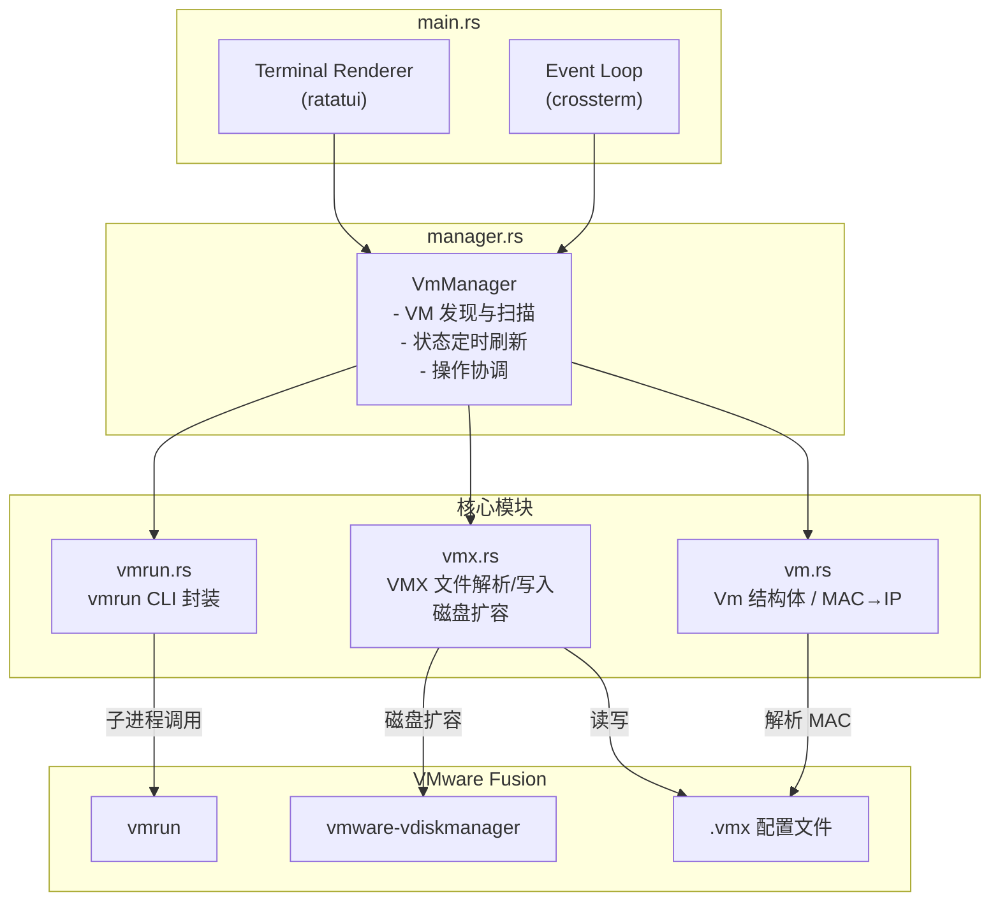

# VMCTL

一个为 VMware Fusion 设计的终端虚拟机管理界面，灵感来自 [K9s](https://k9scli.io/)。

## 功能特性

- 终端 UI 管理 VMware Fusion 虚拟机
- 支持启动、停止、挂起、恢复虚拟机
- 自动检测虚拟机状态（运行中/已停止/已挂起）
- 自动获取虚拟机 IP 地址（通过 MAC 地址转换）
- 键盘友好的操作方式（类 K9s 风格）

## 技术选型

- **Rust** - 系统编程语言，提供高性能和内存安全
- **ratatui** - Rust 终端 UI 库，支持丰富的文本样式和布局
- **crossterm** - 跨平台终端操作库，处理键盘输入和终端特性
- **vmrun** - VMware Fusion 命令行工具，通过子进程调用

## 快速开始

### 构建

```bash
cargo build --release
```

### 安装

```bash
./install.sh
```

或者手动将可执行文件添加到 PATH：

```bash
cp target/release/vmctl-rust ~/.local/bin/vmctl
chmod +x ~/.local/bin/vmctl
```

确保 `~/.local/bin` 在你的 PATH 中：

```bash
export PATH="$HOME/.local/bin:$PATH"
```

## 配置

vmctl 通过**环境变量**加载配置，可在 shell 配置文件（`.zshrc` / `.bashrc`）中导出：

```bash
export VMCTL_VMRUN_PATH="/Applications/VMware Fusion.app/Contents/Library/vmrun"
export VMCTL_VM_DIR="$HOME/Virtual Machines.localized"
export VMCTL_REFRESH_INTERVAL=5
export VMCTL_LOGO_PATH="$HOME/.config/vmctl/logo.txt"
```

### 配置说明

| 环境变量 | 说明 | 默认值 |
|----------|------|--------|
| `VMCTL_VMRUN_PATH` | vmrun 命令路径 | `/Applications/VMware Fusion.app/Contents/Library/vmrun` |
| `VMCTL_VM_DIR` | 虚拟机目录 | `$HOME/Virtual Machines.localized` |
| `VMCTL_REFRESH_INTERVAL` | 状态刷新间隔（秒） | `5` |
| `VMCTL_LOGO_PATH` | ASCII 艺术字文件路径（未设置时使用内置 logo） | 未设置 |

## 操作

| 按键 | 功能 |
|------|------|
| `w` / `s` 或 `↑` / `↓` | 上下移动选择 |
| `Enter` | 启动虚拟机 |
| `x` | 停止虚拟机 |
| `p` | 挂起虚拟机 |
| `r` | 继续运行（恢复） |
| `i` | 查看/编辑虚拟机配置 |
| `n` | 快照管理 |
| `c` | 克隆虚拟机 |
| `f` | 端口转发管理 |
| `h` | 共享文件夹管理 |
| `g` | 客户系统文件浏览器 |
| `t` | SSH 连接到虚拟机 |
| `R` | 启动/停止 vmrest 服务 |
| `D` | 删除虚拟机 |
| `q` | 退出 |

### 配置详情视图（按 `i` 进入）

| 按键 | 功能 |
|------|------|
| `w` / `s` 或 `↑` / `↓` | 上下移动选择 |
| `e` | 编辑选中字段（CPU/内存/磁盘大小） |
| `W` | 保存修改 |
| `u` | 撤销未保存的修改 |
| `Esc` / `i` | 返回列表 |

### SSH 连接（按 `t` 进入）

选中一个运行中的虚拟机，按 `t` 键即可通过 SSH 连接到该虚拟机。

**前提条件：**
- 虚拟机必须处于运行状态
- 虚拟机已获取到 IP 地址
- 虚拟机内已启用 SSH 服务（如 `sshd`）

**操作流程：**
1. 在列表中选中目标虚拟机
2. 按 `t` 弹出 SSH 连接对话框
3. 填写用户名（默认 `root`）和端口（默认 `22`）
4. 按 `Tab` 切换字段，按 `Enter` 确认连接
5. TUI 会暂时让出终端，进入交互式 SSH 会话
6. SSH 会话结束（`exit` 或 `Ctrl+D`）后自动恢复 TUI 界面

## 设计

### 架构



### 模块

- **vm.rs** - 虚拟机数据结构，包含路径、名称、状态、IP
- **vmrun.rs** - vmrun 命令封装，提供启动/停止/挂起/恢复等操作
- **vmx.rs** - VMX 配置文件解析与写入，硬件配置提取，磁盘扩容
- **manager.rs** - 虚拟机管理器，负责定时刷新状态和操作协调
- **main.rs** - 主程序入口，TUI 渲染和事件处理

### 状态检测

VMware Fusion 不提供直接查询虚拟机状态 API，本项目通过以下方式判断：

1. **运行中** - 通过 `vmrun list` 命令获取正在运行的虚拟机列表
2. **已挂起** - 通过检测 `.vmss` 文件是否存在（挂起时生成）
3. **已停止** - 既不在运行列表中，也没有 `.vmss` 文件

### IP 地址获取

虚拟机通常配置 NAT 网络，IP 地址在 `172.16.x.x` 网段。通过解析 `.vmx` 配置文件中的 MAC 地址，将 MAC 地址的后两字节转换为 IP 地址：

```
MAC: 00:0C:29:50:A2:D3  →  IP: 172.16.50.2
```

## 依赖

- macOS
- VMware Fusion
- Rust 1.70+
