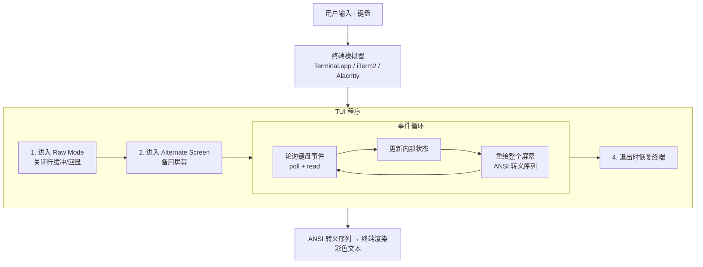
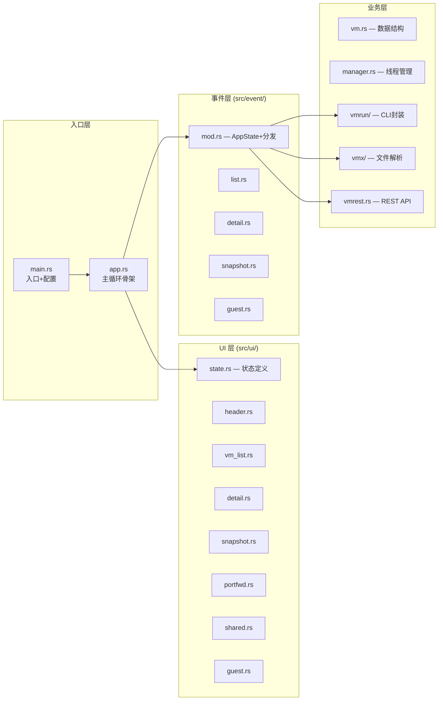
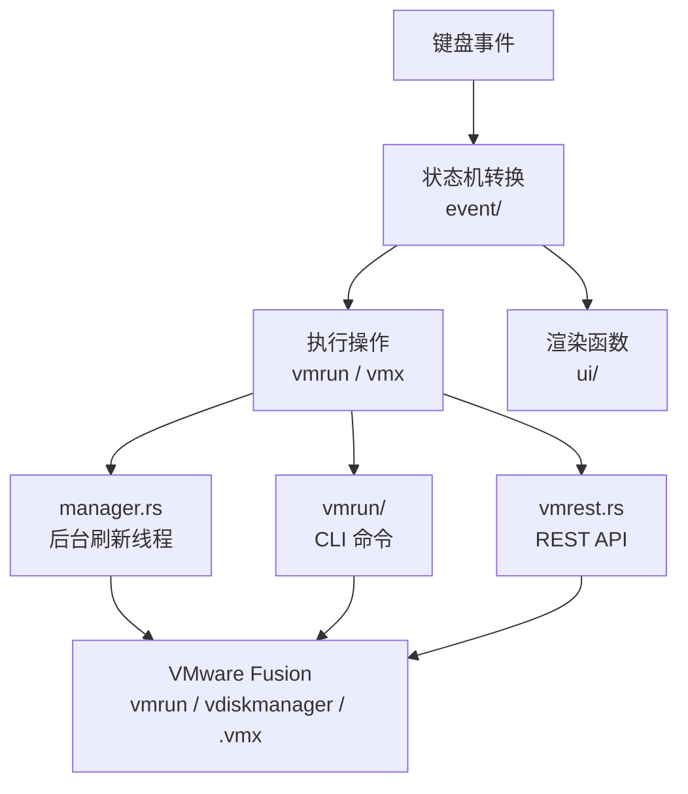
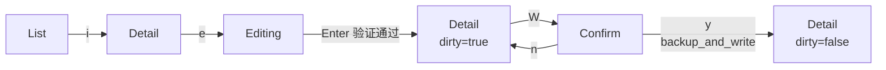
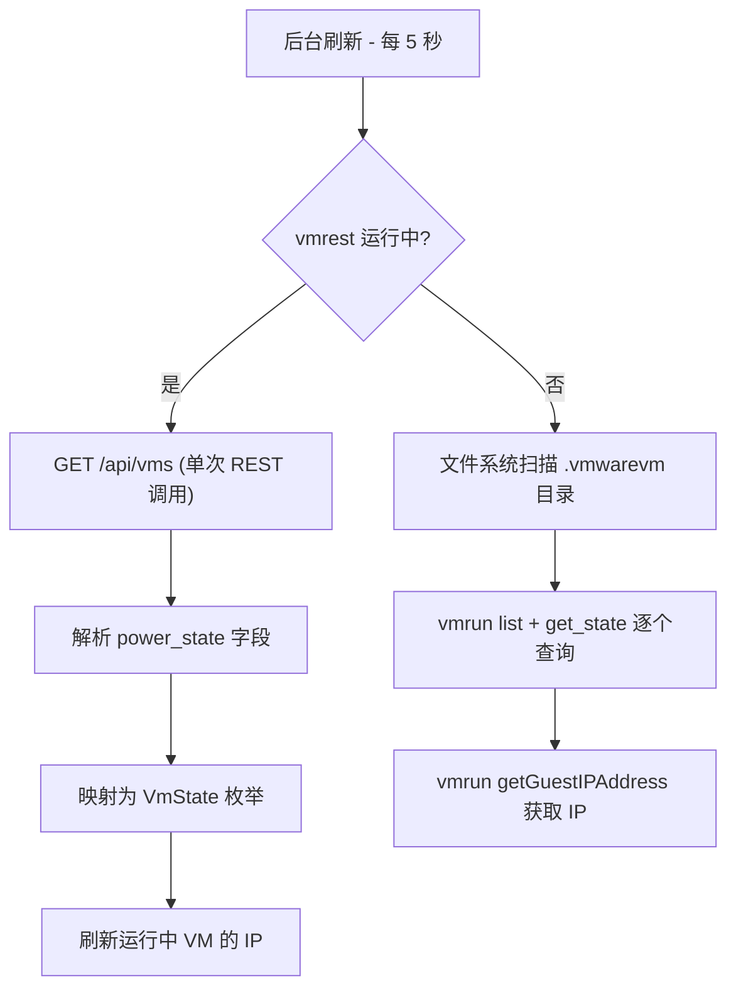
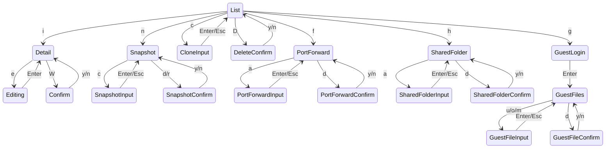
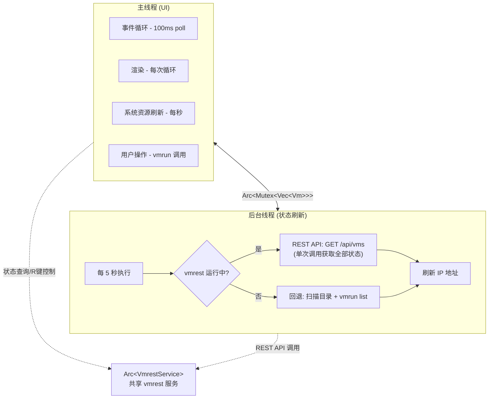

# vmctl-rust 技术文档

## 目录

1. [TUI 概述](#1-tui-概述)
2. [Rust TUI 框架](#2-rust-tui-框架)
3. [项目架构](#3-项目架构)
4. [功能实现详解](#4-功能实现详解)
   - [4.1 VM 列表与状态管理](#41-vm-列表与状态管理)
   - [4.2 VM 配置查看与修改](#42-vm-配置查看与修改)
   - [4.3 快照管理](#43-快照管理)
   - [4.4 克隆 VM](#44-克隆-vm)
   - [4.5 删除 VM](#45-删除-vm)
   - [4.6 端口转发管理](#46-端口转发管理)
   - [4.7 共享文件夹](#47-共享文件夹)
   - [4.8 客户系统文件操作](#48-客户系统文件操作)
   - [4.9 vmrest REST API 集成](#49-vmrest-rest-api-集成)
   - [4.10 IP 地址获取](#410-ip-地址获取)
   - [4.11 磁盘扩容](#411-磁盘扩容)
5. [UI 状态机](#5-ui-状态机)
6. [线程模型](#6-线程模型)
7. [按键绑定一览](#7-按键绑定一览)

---

## 1. TUI 概述

### 什么是 TUI

TUI（Terminal User Interface，终端用户界面）是一种在终端/控制台中运行的图形界面程序。与 GUI（图形用户界面）不同，TUI 只使用文本字符来绘制界面元素（边框、表格、颜色、高亮等），不依赖窗口系统。

### TUI 的工作原理



### TUI vs GUI vs CLI

| 特性 | CLI | TUI | GUI |
|------|-----|-----|-----|
| 交互方式 | 命令行参数/管道 | 键盘导航 | 鼠标+键盘 |
| 运行环境 | 终端 | 终端 | 窗口系统 |
| 典型程序 | `ls`、`grep` | `htop`、`vim`、K9s | VS Code、Chrome |
| 渲染方式 | stdout 文本流 | ANSI 转义序列 | GPU/图形 API |
| 依赖 | 无 | 终端模拟器 | 窗口管理器 |
| 远程使用 | ✅ SSH 直接用 | ✅ SSH 直接用 | ❌ 需要 X11/VNC |

### 为什么用 TUI 管理虚拟机

- **SSH 友好**: 可以在远程 SSH 会话中管理 VM，无需图形桌面
- **资源占用低**: 不需要 GPU、窗口系统，内存 < 20MB
- **键盘高效**: 所有操作都是快捷键，比鼠标点击更快
- **灵感来源**: [K9s](https://k9scli.io/)（Kubernetes TUI 管理器）的操作体验

---

## 2. Rust TUI 框架

### 依赖概览

本项目仅使用 3 个直接依赖（极简哲学）：

```toml
[dependencies]
crossterm = "0.29.0"   # 终端底层操作
ratatui = "0.30.0"     # TUI 组件库
sysinfo = "0.32"       # 系统 CPU/内存监控
```

### 2.1 crossterm — 终端底层抽象

[crossterm](https://github.com/crossterm-rs/crossterm) 提供跨平台的终端控制能力：

**核心功能**:
- **Raw Mode**: 关闭终端的行缓冲和字符回显，让程序逐键接收输入
- **Alternate Screen**: 切换到备用屏幕缓冲区，退出时恢复原始终端内容
- **事件系统**: 非阻塞的键盘/鼠标/窗口事件轮询

**在本项目中的使用**:

```rust
use crossterm::event::{self, Event, KeyCode, KeyEventKind};

// 非阻塞事件轮询（100ms 超时）
if event::poll(Duration::from_millis(100))? {
    if let Event::Key(key) = event::read()? {
        if key.kind != KeyEventKind::Press {
            continue;  // 忽略 key release 事件
        }
        match key.code {
            KeyCode::Char('q') => return Ok(()),
            KeyCode::Enter => { /* 执行操作 */ }
            _ => {}
        }
    }
}
```

**关键设计决策**: 使用 `poll(100ms)` 而非阻塞 `read()`，这样即使没有键盘输入，每 100ms 也会超时返回，让主循环得以继续执行渲染和资源刷新。

### 2.2 ratatui — TUI 组件库

[ratatui](https://github.com/ratatui/ratatui) 是 Rust 生态中最流行的 TUI 框架，提供立即模式（Immediate Mode）渲染 API。

**核心概念**:

#### Layout（布局系统）

将屏幕区域按比例/固定尺寸分割：

```rust
let chunks = Layout::default()
    .direction(Direction::Vertical)
    .constraints([
        Constraint::Length(7),   // 固定 7 行 header
        Constraint::Min(1),      // 剩余空间给表格
    ])
    .split(area);
```

#### Widget（组件）

预定义的可视组件：

| 组件 | 用途 | 本项目中使用 |
|------|------|-------------|
| `Paragraph` | 文本段落 | Header 快捷键提示、消息栏 |
| `Table` | 表格（带表头、可选中） | VM 列表、配置详情、快照列表 |
| `Block` | 边框容器 | 所有面板的边框和标题 |
| `TableState` | 表格选中状态 | 跟踪当前选中行 |

#### Style（样式系统）

每个文本 Span 可设置前景色、背景色、修饰符：

```rust
let style = Style::new()
    .fg(Color::Green)      // 前景色
    .bg(Color::Black)      // 背景色
    .add_modifier(Modifier::BOLD);  // 加粗
```

#### Immediate Mode 渲染

每帧重绘整个屏幕（不追踪 diff）：

```rust
terminal.draw(|frame| {
    // 每次 draw 闭包执行时，重新计算并绘制整个界面
    frame.render_widget(paragraph, area);
    frame.render_stateful_widget(table, area, &mut table_state);
})?;
```

这种模式的优点是简单——不需要管理 UI 状态树或虚拟 DOM，缺点是每帧需要重新构建所有组件。ratatui 内部会做 diff 优化，只将实际变化的字符输出到终端。

### 2.3 sysinfo — 系统信息

用于获取 CPU 使用率和内存占用，每秒刷新一次显示在 header 中：

```rust
sys.refresh_cpu_usage();
sys.refresh_memory();
let cpu_usage = sys.global_cpu_usage();
let mem_usage = (sys.used_memory() as f64 / sys.total_memory() as f64 * 100.0) as f32;
```

---

## 3. 项目架构

### 模块结构

> 注：重构后已拆分为 30 个文件，详见 `src/` 目录。以下为逻辑分组。



### 数据流



### 主循环伪代码

```rust
loop {
    // 1. 获取最新 VM 列表（线程安全）
    let vms = manager.get_vms();

    // 2. 每秒刷新系统资源
    if last_refresh.elapsed() >= 1s {
        refresh_cpu_and_memory();
    }

    // 3. 渲染当前模式的界面
    terminal.draw(|frame| {
        match app_mode {
            AppMode::List => render_vm_list(),
            AppMode::Detail => render_config_detail(),
            AppMode::Snapshot => render_snapshot_list(),
            // ... 其他模式
        }
    });

    // 4. 非阻塞事件轮询（100ms 超时）
    if event::poll(100ms)? {
        // 5. 根据当前模式分发按键
        handle_key_event(key, &mut app_mode);
    }

    // 6. 清除过期消息
    if message_timer.elapsed() > 3s {
        message = None;
    }
}
```

---

## 4. 功能实现详解

### 4.1 VM 列表与状态管理

**涉及文件**: `manager.rs`, `vm.rs`, `vmrun.rs`, `main.rs`

#### VM 发现

```rust
// manager.rs - scan_vms()
1. 遍历 vm_dir（如 ~/Virtual Machines.localized/）
2. 查找所有 .vmwarevm 结尾的目录
3. 在每个目录中查找 .vmx 文件
4. 为每个 .vmx 创建 Vm 实例
```

#### 状态检测（无直接 API，组合判断）

VMware Fusion 不提供 "查询单个 VM 状态" 的命令，本项目通过以下组合判断：

```rust
// vmrun.rs - get_state()
pub fn get_state(vmx_path: &PathBuf) -> Result<VmState, VmrunError> {
    let running_vms = Self::list_running()?;  // vmrun list
    let is_running = running_vms.contains(vmx_path);
    let is_suspended = Self::has_vmss_file(vmx_path);  // .vmss 文件检测

    match (is_running, is_suspended) {
        (true, _)      => Ok(VmState::Running),
        (false, true)  => Ok(VmState::Paused),
        (false, false) => Ok(VmState::Stopped),
    }
}
```

#### 线程安全的后台刷新

```rust
// manager.rs - start_state_refresher()
thread::spawn(move || {
    loop {
        thread::sleep(Duration::from_secs(interval));

        // 1. 重新扫描目录（检测新增/删除的 VM）
        let mut vm_list = vms.lock().unwrap();
        // ... 重新扫描 ...
        drop(vm_list);  // 先释放锁

        // 2. 逐个刷新状态
        for path in vm_paths {
            if let Ok(state) = Vmrun::get_state(&path) {
                let mut vm_list = vms.lock().unwrap();
                // 更新状态
                // 刷新 IP
            }
        }
    }
});
```

**线程同步**: 使用 `Arc<Mutex<Vec<Vm>>>` — 主线程和后台线程共享 VM 列表，通过 Mutex 互斥访问。

#### 渲染（Table 组件）

```rust
// main.rs - render_table()
let rows: Vec<Row> = vms.iter().enumerate().map(|(i, vm)| {
    let state_color = match vm.state {
        VmState::Running => Color::Green,   // 绿色 ● Running
        VmState::Stopped => Color::Red,     // 红色 ● Stopped
        VmState::Paused  => Color::Yellow,  // 黄色 ● Paused
        VmState::Unknown => Color::DarkGray,
    };
    // 选中行蓝色背景，奇偶行交替色
    if is_selected { row.style(bg(Blue)) }
    else if i % 2 == 0 { row.style(bg(Black)) }
    else { row.style(bg(Rgb(30,30,30))) }
}).collect();

let table = Table::new(rows, col_widths)
    .header(header)
    .column_spacing(1);
frame.render_stateful_widget(table, area, &mut table_state);
```

---

### 4.2 VM 配置查看与修改

**涉及文件**: `vmx.rs`, `main.rs`  
**快捷键**: `i` 进入，`e` 编辑，`W` 保存

#### VMX 文件解析器

.vmx 是 VMware 虚拟机的核心配置文件（key = "value" 纯文本格式）。

设计原则：**保留原始文件结构**。使用 `Vec<VmxEntry>` 按顺序存储每一行，确保写回时不丢失注释和未知键：

```rust
// vmx.rs
enum VmxEntry {
    KeyValue { key: String, value: String },  // 配置项
    Other(String),                            // 注释/空行
}

struct VmxFile {
    entries: Vec<VmxEntry>,           // 保序存储
    index: HashMap<String, usize>,    // 快速查找
    path: PathBuf,
}
```

#### 硬件配置提取

从 VmxFile 的键值对中提取结构化信息：

```rust
// vmx.rs - hardware_config()
pub fn hardware_config(&self) -> HardwareConfig {
    let cpu_count = self.get("numvcpus").parse().unwrap_or(1);
    let memory_mb = self.get("memsize").parse().unwrap_or(0);

    // 扫描网络适配器 (ethernet0..3)
    for i in 0..4 {
        if self.get(&format!("ethernet{}.present", i)) == "TRUE" {
            // 提取 connectionType, generatedAddress
        }
    }

    // 扫描磁盘 (scsi0:0, sata0:0, nvme0:0)
    for controller in ["scsi0", "sata0", "nvme0"] {
        for unit in 0..4 {
            if present && filename.ends_with(".vmdk") {
                // 读取 vmdk 描述文件获取磁盘大小
            }
        }
    }
}
```

#### 安全写入

```rust
// vmx.rs - backup_and_write()
pub fn backup_and_write(&self) -> Result<(), VmxError> {
    // 1. 备份: .vmx → .vmx.bak
    std::fs::copy(&self.path, self.path.with_extension("vmx.bak"))?;

    // 2. 写入临时文件
    self.write_to(&self.path.with_extension("vmx.tmp"))?;

    // 3. 原子 rename (防止写一半崩溃导致文件损坏)
    std::fs::rename(tmp_path, &self.path)?;
    Ok(())
}
```

#### 编辑模式流程



---

### 4.3 快照管理

**涉及文件**: `vmrun.rs`, `main.rs`  
**快捷键**: `n` 进入快照视图

#### vmrun 命令

| 操作 | 命令 | 备注 |
|------|------|------|
| 列出 | `vmrun listSnapshots <vmx>` | 输出首行为 `Total snapshots: N` |
| 创建 | `vmrun snapshot <vmx> <name>` | 任意状态均可创建 |
| 删除 | `vmrun deleteSnapshot <vmx> <name>` | 删除指定快照 |
| 恢复 | `vmrun revertToSnapshot <vmx> <name>` | 回到快照时的状态 |

#### 输出解析

```rust
// vmrun.rs - list_snapshots()
pub fn list_snapshots(vmx_path: &PathBuf) -> Result<Vec<String>, VmrunError> {
    let output = Self::execute(&["listSnapshots", vmx_path.to_str().unwrap()])?;
    // 跳过首行 "Total snapshots: N"，每行 trim 为一个快照名
    output.lines().skip(1)
        .map(|line| line.trim().to_string())
        .filter(|s| !s.is_empty())
        .collect()
}
```

#### UI 状态

```rust
struct SnapshotState {
    snapshots: Vec<String>,  // 快照列表
    selected: usize,         // 选中索引
    vm_name: String,
    vmx_path: PathBuf,
}
```

操作后自动刷新列表（重新调用 `list_snapshots`）。

---

### 4.4 克隆 VM

**涉及文件**: `vmrun.rs`, `main.rs`  
**快捷键**: `c` 弹出克隆对话框

#### vmrun 命令

```bash
vmrun clone <source.vmx> <dest.vmx> full|linked -cloneName=<name>
```

- **full**: 完整克隆，独立副本（占用空间 = 原 VM）
- **linked**: 链接克隆，共享基础磁盘（省空间，但依赖源 VM）

#### 目标路径计算

```rust
// 源: ~/Virtual Machines.localized/Ubuntu.vmwarevm/Ubuntu.vmx
// 名: Ubuntu-clone
// 目标: ~/Virtual Machines.localized/Ubuntu-clone.vmwarevm/Ubuntu-clone.vmx
let source_dir = vmx_path.parent().parent();  // Virtual Machines.localized/
let dest_dir = source_dir.join(format!("{}.vmwarevm", name));
let dest_vmx = dest_dir.join(format!("{}.vmx", name));
```

#### 类型切换

对话框中按 `Tab` 切换 `Full ↔ Linked`：

```rust
enum CloneType { Full, Linked }
// Tab 切换
ci.clone_type = match ci.clone_type {
    CloneType::Full => CloneType::Linked,
    CloneType::Linked => CloneType::Full,
};
```

---

### 4.5 删除 VM

**涉及文件**: `vmrun.rs`, `main.rs`  
**快捷键**: `D` (Shift+D，防误触)

#### 安全措施

1. **VM 必须已停止** — 运行中/挂起的 VM 拒绝删除
2. **确认对话框** — 红色警告 "此操作不可恢复"
3. **大写 D** — 避免与小写快捷键冲突

```rust
// 检查状态
if vm_state != Some(&VmState::Stopped) {
    message = "✗ 虚拟机必须停止后才能删除";
    return;
}
// 确认后执行
Vmrun::delete_vm(&vmx_path)?;  // vmrun deleteVM <vmx>
```

---

### 4.6 端口转发管理

**涉及文件**: `vmrun.rs`, `main.rs`  
**快捷键**: `f` 进入端口转发视图

#### 原理

VMware Fusion 的 NAT 网络（vmnet8）支持端口转发：将宿主机端口映射到虚拟机端口。

例如：`宿主机:2222` (TCP) 转发到 `虚拟机(172.16.170.128):22`

#### vmrun 命令

```bash
# 自动识别 NAT 网络
vmrun listHostNetworks
# 输出: vmnet8  nat  true  172.16.170.0  255.255.255.0

# 列出规则
vmrun listPortForwardings vmnet8
# 输出: [tcp] 2222 -> 172.16.170.128:22 SSH

# 添加规则
vmrun setPortForwarding vmnet8 tcp 2222 172.16.170.128 22 "SSH"

# 删除规则
vmrun deletePortForwarding vmnet8 tcp 2222
```

#### 输出解析

```rust
// vmrun.rs - PortForwarding::parse()
// 输入: "[tcp] 2222 -> 172.16.170.128:22 SSH"
fn parse(line: &str) -> Option<Self> {
    // 1. 提取 [protocol]
    // 2. 提取 host_port
    // 3. 跳过 "->"
    // 4. 分割 guest_ip:guest_port
    // 5. 剩余为 description
}
```

#### 多字段输入表单

添加规则时有 5 个字段，用 `Tab`/`Shift+Tab` 切换：

```rust
struct PortForwardInputState {
    field_index: usize,       // 当前字段 (0-4)
    fields: [String; 5],      // [协议, 宿主端口, 客户IP, 客户端口, 描述]
}
```

渲染时当前字段显示 `▶` 标记和光标 `_`。

---

### 4.7 共享文件夹

**涉及文件**: `vmrun.rs`, `main.rs`  
**快捷键**: `h` 进入共享文件夹视图

#### 原理

VMware 共享文件夹让宿主和客户系统共享目录。客户系统中通过 `/mnt/hgfs/<share_name>` 或 `\\vmware-host\Shared Folders\<share_name>` 访问。

#### 配置来源

共享文件夹配置存储在 .vmx 文件中：

```
sharedFolder.maxNum = "2"
sharedFolder0.present = "TRUE"
sharedFolder0.enabled = "TRUE"
sharedFolder0.readAccess = "TRUE"
sharedFolder0.writeAccess = "TRUE"
sharedFolder0.hostPath = "/Users/jane/shared"
sharedFolder0.guestName = "host_shared"
```

#### 解析逻辑

```rust
fn parse_shared_folders_from_vmx(vmx_path: &PathBuf) -> (Vec<SharedFolderEntry>, bool) {
    // 1. 读取 .vmx 文件
    // 2. 检查 sharedFolder.maxNum > 0 → enabled
    // 3. 遍历 sharedFolder0..15:
    //    - present == "TRUE" ?
    //    - 提取 hostPath, guestName, writeAccess
    // 4. 返回列表
}
```

#### 启用/禁用（按 `e` 切换）

```rust
// 需要 VM 运行中
Vmrun::enable_shared_folders(&vmx_path)?;   // vmrun enableSharedFolders <vmx> runtime
Vmrun::disable_shared_folders(&vmx_path)?;  // vmrun disableSharedFolders <vmx> runtime
```

---

### 4.8 客户系统文件操作

**涉及文件**: `vmrun.rs`, `main.rs`  
**快捷键**: `g` 进入（需 VM 运行中 + VMware Tools）

#### 认证机制

所有客户系统操作需要 `-gu <user> -gp <password>` 参数。本项目在进入时弹出登录对话框：

```rust
struct GuestLoginState {
    field_index: usize,         // 0=用户名, 1=密码
    fields: [String; 2],        // 值
}
```

密码渲染时用 `*` 遮盖：

```rust
let display = if i == 1 { // 密码字段
    "*".repeat(field.len())
} else {
    field.clone()
};
```

#### 带凭据的命令执行

```rust
// vmrun.rs - execute_guest()
fn execute_guest(vmx_path: &PathBuf, user: &str, pass: &str, args: &[&str]) -> Result<String, VmrunError> {
    let mut cmd_args: Vec<&str> = vec!["-gu", user, "-gp", pass];
    cmd_args.extend_from_slice(args);
    Command::new(get_vmrun_path()).args(&cmd_args).output()?
}
```

#### 文件浏览器

界面示意（`user@Ubuntu: /home/user`）：

| FILE / DIRECTORY | 操作 |
|------------------|------|
| `..` | Enter 返回上级 |
| `Documents` | Enter 进入 |
| `config.yaml` | o 下载 / d 删除 |
| `script.sh` | o 下载 / d 删除 |

目录导航逻辑：

```rust
KeyCode::Enter => {
    let entry = entries[selected].clone();
    let new_dir = if entry == ".." {
        // 返回上级: /home/user → /home
        Path::new(&current_dir).parent().to_string()
    } else {
        format!("{}/{}", current_dir, entry)
    };
    // 尝试 listDirectoryInGuest，失败说明是文件
    match Vmrun::list_directory_in_guest(..., &new_dir) {
        Ok(entries) => { current_dir = new_dir; }
        Err(_) => { message = "无法进入（可能是文件）"; }
    }
}
```

---

### 4.9 vmrest REST API 集成

**涉及文件**: `vmrest.rs`, `manager.rs`, `main.rs`  
**快捷键**: `R` (Shift+R) 手动启动/停止（默认自动启动）

#### 为什么集成 vmrest

| 对比 | vmrun | vmrest |
|------|-------|--------|
| 调用方式 | 每次 fork 新进程 | HTTP 请求到长驻进程 |
| 启动开销 | ~50ms/次 | 0（已启动） |
| 适合场景 | 低频操作 | 高频查询（状态轮询） |
| 配置需求 | 无 | 需要凭据（本项目用 Unix Socket 绕过） |

#### 自动启动与回退机制

应用启动时自动启动 vmrest 服务，无需手动按 `R`。后台刷新线程采用双路径策略：



**性能对比**（假设 10 个虚拟机）：

| 方式 | 每次刷新的系统调用 | 耗时估算 |
|------|------------------|---------|
| vmrun 回退方式 | 10+ 次 fork/exec | ~500ms |
| vmrest REST 方式 | 1 次 socket 连接 | ~5ms |

#### 电源状态映射

vmrest API 返回的 `power_state` 字段映射到内部 `VmState` 枚举：

```rust
pub fn vmrest_power_to_state(power_state: &str) -> VmState {
    match power_state {
        "poweredOn"  => VmState::Running,
        "poweredOff" => VmState::Stopped,
        "suspended"  => VmState::Paused,
        _            => VmState::Unknown,
    }
}
```

#### Unix Socket 模式

使用 `-U -p -1` 参数启动 vmrest：
- `-U`: 监听 Unix Socket（`/tmp/vmrest.sock`）
- `-p -1`: 禁用 TCP 端口（不暴露网络接口，更安全）

```rust
Command::new(vmrest_path)
    .args(["-U", "-p", "-1"])
    .spawn()?;
```

#### 手动实现 HTTP over Unix Socket

不使用任何 HTTP 库，直接通过 `UnixStream` 发送原始 HTTP 请求：

```rust
use std::os::unix::net::UnixStream;

fn request(&self, method: &str, path: &str) -> Result<String, String> {
    let mut stream = UnixStream::connect("/tmp/vmrest.sock")?;

    // 手动构建 HTTP/1.1 请求
    let request = format!(
        "{} {} HTTP/1.1\r\nHost: localhost\r\nAccept: application/json\r\nConnection: close\r\n\r\n",
        method, path
    );
    stream.write_all(request.as_bytes())?;

    // 解析响应头获取 Content-Length
    // 读取 body
    // 返回 JSON 字符串
}
```

#### 简易 JSON 解析

不引入 serde_json，手动解析 vmrest 返回的简单 JSON：

```rust
// 从 {"id":"abc","path":"/...","power_state":"poweredOn"} 中提取字段
fn extract_json_value(json: &str, key: &str) -> Result<String, String> {
    // 1. 搜索 "key":
    // 2. 跳到冒号后
    // 3. 如果是引号开头 → 提取字符串值
    // 4. 否则 → 提取到逗号/}为止
}
```

#### 共享与线程安全

`VmrestService` 通过 `Arc` 在主线程和后台刷新线程间共享：

```rust
let vmrest = Arc::new(VmrestService::new());
// 传给 VmManager（后台线程使用）
let manager = VmManager::new(config.vm_dir, Some(Arc::clone(&vmrest)));
// 传给 run_app（主线程 UI 使用）
app::run_app(&mut terminal, &manager, &ascii_art, &vmrest);
```

#### 生命周期管理

```rust
impl Drop for VmrestService {
    fn drop(&mut self) {
        let _ = self.stop();  // 程序退出时自动清理子进程
    }
}
```

---

### 4.10 IP 地址获取

**涉及文件**: `vm.rs`, `vmrun.rs`

#### 双重策略

```rust
// vm.rs - refresh_ip()
pub fn refresh_ip(&mut self) {
    if self.state == VmState::Running {
        // 策略1: getGuestIPAddress（准确，需 VMware Tools）
        if let Ok(ip) = Vmrun::get_guest_ip(&self.vmx_path) {
            self.ip = Some(ip);
            return;
        }
    }
    // 策略2: MAC 地址推算（回退方案）
    self.read_ip_from_vmx();
}
```

#### MAC → IP 推算原理

VMware NAT 模式 DHCP 分配 IP 的规律（近似）：

```
MAC:  00:0C:29:XX:YY:ZZ
IP:   172.16.XX.YY     (MAC 第4、5字节的十进制)
```

---

### 4.11 磁盘扩容

**涉及文件**: `vmx.rs`  
**触发**: 详情视图中选中磁盘行按 `e`

#### vmware-vdiskmanager 工具

```bash
vmware-vdiskmanager -x 100GB /path/to/disk.vmdk
```

注意：
- 只能**扩大**不能缩小
- VM 必须**停机**
- 扩容后需在客户系统中扩展分区

#### 磁盘大小读取

从 VMDK 描述文件（文本格式）解析 extent 信息：

```
RW 83886080 SPARSE "disk-s001.vmdk"
RW 83886080 SPARSE "disk-s002.vmdk"
```

```rust
// vmx.rs - read_vmdk_size_gb()
fn read_vmdk_size_gb(vmdk_path: &Path) -> Option<u64> {
    // 累加所有 "RW <sectors> SPARSE/FLAT ..." 行的扇区数
    // 扇区 × 512 / 1024³ = GB
    total_sectors * 512 / 1024 / 1024 / 1024
}
```

---

## 5. UI 状态机

整个 TUI 使用有限状态机管理界面模式：

```rust
enum AppMode {
    List,               // 主列表
    Detail,             // 配置详情
    Editing,            // 字段编辑
    Confirm,            // 保存确认
    Snapshot,           // 快照列表
    SnapshotInput,      // 快照名输入
    SnapshotConfirm,    // 快照操作确认
    CloneInput,         // 克隆名输入
    DeleteConfirm,      // 删除确认
    PortForward,        // 端口转发列表
    PortForwardInput,   // 添加转发输入
    PortForwardConfirm, // 删除转发确认
    SharedFolder,       // 共享文件夹
    SharedFolderInput,  // 添加共享输入
    SharedFolderConfirm,// 删除共享确认
    GuestLogin,         // 客户凭据输入
    GuestFiles,         // 客户文件浏览
    GuestFileInput,     // 文件操作输入
    GuestFileConfirm,   // 文件删除确认
}
```

**状态转换图**（简化）：



所有子视图都可以通过 `Esc` 返回上一级。

---

## 6. 线程模型



**同步机制**:
- `Arc<Mutex<Vec<Vm>>>`: VM 列表在主线程和后台线程间共享
  - `Arc`: 引用计数，允许多线程持有
  - `Mutex`: 互斥锁，一次只有一个线程可读写
  - 后台线程在扫描和刷新时短暂持锁，主线程在获取列表时 `clone()` 后立即释放锁
- `Arc<VmrestService>`: vmrest 服务在主线程（UI 状态显示、R 键控制）和后台线程（REST API 查询）间共享

---

## 7. 按键绑定一览

### 主列表 (List)

| 按键 | 功能 | 实现 |
|------|------|------|
| `w`/`s`/`↑`/`↓` | 上下导航 | 修改 `TableState.selected` |
| `Enter` | 启动 VM | `vmrun start <vmx> nogui` |
| `x` | 停止 VM | `vmrun stop <vmx>` |
| `p` | 挂起 VM | `vmrun suspend <vmx>` |
| `r` | 恢复 VM | `vmrun start <vmx>`（从 .vmss 恢复） |
| `i` | 配置详情 | 解析 .vmx → Detail 模式 |
| `n` | 快照管理 | `vmrun listSnapshots` → Snapshot 模式 |
| `c` | 克隆 VM | 弹出 CloneInput 对话框 |
| `f` | 端口转发 | 列出 NAT 网络规则 → PortForward 模式 |
| `h` | 共享文件夹 | 解析 .vmx 共享配置 → SharedFolder 模式 |
| `g` | 客户文件 | 弹出 GuestLogin 凭据框 |
| `R` | vmrest 开关 | 启动/停止 vmrest 服务 |
| `D` | 删除 VM | 弹出 DeleteConfirm 确认 |
| `q`/`Esc` | 退出 | 恢复终端并退出 |

### 通用操作

| 按键 | 上下文 | 功能 |
|------|--------|------|
| `Tab` | 多字段输入框 | 下一个字段 |
| `Shift+Tab` | 多字段输入框 | 上一个字段 |
| `Enter` | 输入框/确认框 | 确认操作 |
| `Esc` | 任何子视图 | 返回上一级 |
| `y` | 确认对话框 | 确认执行 |
| `n` | 确认对话框 | 取消 |
