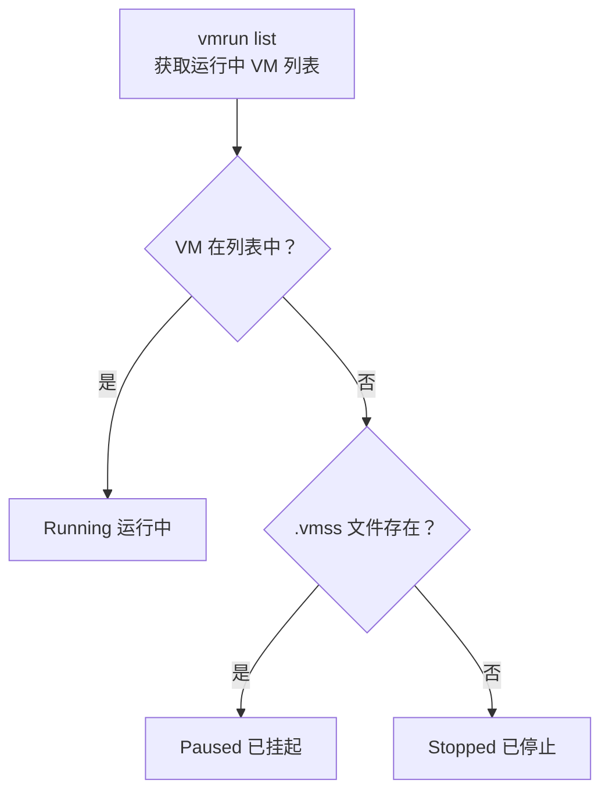
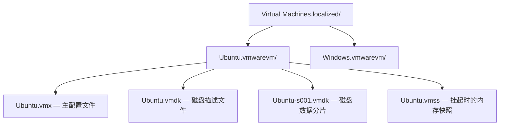

# 本项目使用的 VMware 功能

本文档记录 vmctl-rust 项目中实际调用的 VMware Fusion 提供的命令行工具和文件接口。

## 1. vmrun — 虚拟机运行时控制

**工具路径**: `/Applications/VMware Fusion.app/Contents/Library/vmrun`

vmrun 是 VMware Fusion 提供的命令行工具，用于控制虚拟机的生命周期。本项目通过 `std::process::Command` 以子进程方式调用。

### 使用的命令

| 命令 | 用法 | 项目中的用途 |
|------|------|-------------|
| `start` | `vmrun start <vmx> nogui` | 启动虚拟机（无界面模式） |
| `stop` | `vmrun stop <vmx>` | 停止虚拟机（软关机） |
| `suspend` | `vmrun suspend <vmx>` | 挂起虚拟机（保存内存快照到 .vmss 文件） |
| `list` | `vmrun list` | 列出所有正在运行的虚拟机路径 |
| `getGuestIPAddress` | `vmrun getGuestIPAddress <vmx>` | 获取运行中 VM 的真实 IP 地址 |
| `clone` | `vmrun clone <vmx> <dest> full\|linked` | 克隆虚拟机（完整/链接） |
| `deleteVM` | `vmrun deleteVM <vmx>` | 删除虚拟机（不可恢复） |
| `enableSharedFolders` | `vmrun enableSharedFolders <vmx> runtime` | 启用共享文件夹 |
| `disableSharedFolders` | `vmrun disableSharedFolders <vmx> runtime` | 禁用共享文件夹 |
| `addSharedFolder` | `vmrun addSharedFolder <vmx> <name> <path>` | 添加共享文件夹 |
| `removeSharedFolder` | `vmrun removeSharedFolder <vmx> <name>` | 移除共享文件夹 |
| `listDirectoryInGuest` | `vmrun -gu -gp listDirectoryInGuest <vmx> <dir>` | 列出客户系统目录 |
| `CopyFileFromHostToGuest` | `vmrun -gu -gp CopyFileFromHostToGuest ...` | 上传文件到客户系统 |
| `CopyFileFromGuestToHost` | `vmrun -gu -gp CopyFileFromGuestToHost ...` | 从客户系统下载文件 |
| `createDirectoryInGuest` | `vmrun -gu -gp createDirectoryInGuest <vmx> <dir>` | 在客户系统中创建目录 |
| `deleteFileInGuest` | `vmrun -gu -gp deleteFileInGuest <vmx> <path>` | 在客户系统中删除文件 |
| `listHostNetworks` | `vmrun listHostNetworks` | 列出宿主虚拟网络 |

---

## 2. vmrest — REST API 服务

**工具路径**: `/Applications/VMware Fusion.app/Contents/Library/vmrest`

vmrest 是 VMware Fusion 内置的 HTTP REST API 长驻服务。本项目通过 Unix Socket 模式运行 vmrest（无需凭据配置），利用 HTTP API 进行快速的 VM 状态查询。

### 集成方式

- **启动**: 按 `R` 启动 vmrest（Unix Socket 模式，Socket 位于 `/tmp/vmrest.sock`）
- **停止**: 再次按 `R` 停止
- **状态显示**: header 底部 `REST: ●`（运行中）/ `REST: ○`（停止）

### 使用的 API 端点

| 方法 | 端点 | 功能 |
|------|------|------|
| GET | `/api/vms` | 列出所有已注册的虚拟机 |
| GET | `/api/vms/{id}/power` | 获取电源状态 |

### 通信实现

通过 `std::os::unix::net::UnixStream` 直接与 vmrest Unix Socket 通信，手动构建 HTTP 请求和解析响应。无需外部 HTTP 库。

```rust
// src/vmrest.rs
let stream = UnixStream::connect("/tmp/vmrest.sock")?;
stream.write_all(b"GET /api/vms HTTP/1.1\r\nHost: localhost\r\n\r\n")?;
```
| `listPortForwardings` | `vmrun listPortForwardings <net>` | 列出端口转发规则 |
| `setPortForwarding` | `vmrun setPortForwarding <net> ...` | 添加端口转发规则 |
| `deletePortForwarding` | `vmrun deletePortForwarding <net> ...` | 删除端口转发规则 |
| `listSnapshots` | `vmrun listSnapshots <vmx>` | 列出虚拟机的所有快照 |
| `snapshot` | `vmrun snapshot <vmx> <name>` | 创建快照 |
| `deleteSnapshot` | `vmrun deleteSnapshot <vmx> <name>` | 删除快照 |
| `revertToSnapshot` | `vmrun revertToSnapshot <vmx> <name>` | 恢复到指定快照 |

### 状态检测机制

VMware Fusion 不提供直接查询单个 VM 状态的命令，本项目通过组合方式判断：



- `vmrun list` 输出格式为每行一个 .vmx 绝对路径，首行为 `Total running VMs: N`
- `.vmss` 文件由 VMware 在挂起时自动生成，位于 .vmwarevm 包内

### 调用方式

```rust
// src/vmrun.rs
let output = Command::new("/Applications/VMware Fusion.app/Contents/Library/vmrun")
    .args(&["start", vmx_path, "nogui"])
    .output()?;
```

### 快照管理

通过 TUI 中按 `n` 键进入快照视图，支持查看、创建、删除和恢复快照。

`listSnapshots` 的输出格式：
```
Total snapshots: 3
Snapshot1
Snapshot2
  ChildSnapshot
```

解析逻辑：跳过首行 `Total snapshots: N`，后续每行 trim 后即为快照名。

```rust
// src/vmrun.rs
pub fn list_snapshots(vmx_path: &PathBuf) -> Result<Vec<String>, VmrunError> {
    let output = Self::execute(&["listSnapshots", vmx_path.to_str().unwrap()])?;
    // 跳过首行，每行 trim 为一个快照名
}

pub fn create_snapshot(vmx_path: &PathBuf, name: &str) -> Result<(), VmrunError> {
    Self::execute(&["snapshot", vmx_path.to_str().unwrap(), name])?;
}

pub fn delete_snapshot(vmx_path: &PathBuf, name: &str) -> Result<(), VmrunError> {
    Self::execute(&["deleteSnapshot", vmx_path.to_str().unwrap(), name])?;
}

pub fn revert_to_snapshot(vmx_path: &PathBuf, name: &str) -> Result<(), VmrunError> {
    Self::execute(&["revertToSnapshot", vmx_path.to_str().unwrap(), name])?;
}
```

---

## 2. vmware-vdiskmanager — 虚拟磁盘管理

**工具路径**: `/Applications/VMware Fusion.app/Contents/Library/vmware-vdiskmanager`

本项目使用此工具对虚拟磁盘执行扩容操作。

### 使用的命令

| 选项 | 用法 | 项目中的用途 |
|------|------|-------------|
| `-x` | `vmware-vdiskmanager -x <容量>GB <vmdk文件>` | 扩展虚拟磁盘到指定容量 |

### 注意事项

- 磁盘只能扩容，不能缩小
- VM 必须处于关机状态
- 扩容后需要在客户操作系统内扩展分区才能使用新空间
- 容量单位支持 MB/GB，范围为 1MB ~ 8192GB（IDE/SCSI）

### 调用方式

```rust
// src/vmx.rs
let output = Command::new("/Applications/VMware Fusion.app/Contents/Library/vmware-vdiskmanager")
    .args(["-x", "100GB", "/path/to/disk.vmdk"])
    .output()?;
```

---

## 3. .vmx 配置文件 — 虚拟机硬件定义

**文件位置**: `~/Virtual Machines.localized/<VM名>.vmwarevm/<VM名>.vmx`

.vmx 是 VMware 虚拟机的核心配置文件，纯文本 key-value 格式。本项目直接读写此文件。

### 读取的配置项

| 键名 | 说明 | 示例值 |
|------|------|--------|
| `numvcpus` | CPU 核心数 | `"4"` |
| `memsize` | 内存大小（MB） | `"8192"` |
| `guestos` | 客户操作系统类型 | `"ubuntu-64"` |
| `firmware` | 固件类型 | `"efi"` |
| `ethernet0.present` | 网卡 0 是否启用 | `"TRUE"` |
| `ethernet0.connectiontype` | 网卡 0 连接类型 | `"nat"` |
| `ethernet0.generatedaddress` | 网卡 0 MAC 地址 | `"00:0c:29:50:a2:d3"` |
| `scsi0:0.present` | SCSI 磁盘 0 是否启用 | `"TRUE"` |
| `scsi0:0.filename` | SCSI 磁盘 0 文件名 | `"Ubuntu.vmdk"` |

### 写入的配置项

| 键名 | 修改场景 |
|------|----------|
| `numvcpus` | 用户通过 TUI 修改 CPU 数量 |
| `memsize` | 用户通过 TUI 修改内存大小 |

### 文件格式

```
.encoding = "UTF-8"
config.version = "8"
virtualHW.version = "21"
numvcpus = "4"
memsize = "8192"
ethernet0.present = "TRUE"
ethernet0.connectionType = "nat"
ethernet0.generatedAddress = "00:0c:29:50:a2:d3"
scsi0:0.present = "TRUE"
scsi0:0.fileName = "Ubuntu.vmdk"
```

规则：
- 每行一个键值对，格式为 `key = "value"`
- 键名不区分大小写
- 值用双引号包裹
- `#` 开头为注释行

### IP 地址获取

本项目采用双重策略获取 VM 的 IP 地址：

**1. 优先方式：`getGuestIPAddress`（运行中的 VM）**

对于正在运行且已安装 VMware Tools 的虚拟机，通过 `vmrun getGuestIPAddress` 获取真实 IP。此方式返回客户系统实际分配的 IP，适用于所有网络模式（NAT、桥接、仅主机）。

```rust
// src/vm.rs
if self.state == VmState::Running {
    if let Ok(ip) = Vmrun::get_guest_ip(&self.vmx_path) {
        self.ip = Some(ip);
        return;
    }
}
```

**2. 回退方式：MAC 地址推算（VMware Tools 不可用时）**

当 `getGuestIPAddress` 失败时（VM 未运行、Tools 未安装等），通过 .vmx 文件中的 MAC 地址后两字节推算 NAT 网段 IP：

| MAC 地址 | 第4字节 | 第5字节 | 推算 IP |
|----------|---------|---------|---------|
| `00:0C:29:50:A2:D3` | `0x50` = 80 | `0xA2` = 162 | `172.16.80.162` |

> 注意：MAC 推算仅在 NAT 模式下近似有效，桥接模式下可能不准确。

---

## 4. .vmdk 描述文件 — 虚拟磁盘元数据

**文件位置**: 与 .vmx 同目录，文件名在 .vmx 的 `scsi0:0.fileName` 中指定

.vmdk 描述文件（文本格式）包含磁盘的 extent 描述，本项目通过解析它获取磁盘容量。

### 解析的内容

```
# Disk DescriptorFile
version=1
CID=fffffffe
parentCID=ffffffff
createType="twoGbMaxExtentSparse"

# Extent description
RW 4192256 SPARSE "Ubuntu-s001.vmdk"
RW 4192256 SPARSE "Ubuntu-s002.vmdk"
...
```

本项目解析 `RW <sectors> SPARSE/FLAT "<file>"` 行，累加所有 extent 的扇区数，按 512 字节/扇区换算为 GB：

```rust
total_sectors * 512 / 1024 / 1024 / 1024 = size_gb
```

---

## 5. .vmwarevm 包结构 — 虚拟机文件组织

**路径**: `~/Virtual Machines.localized/<VM名>.vmwarevm/`

macOS 上 VMware Fusion 将虚拟机组织为 .vmwarevm 包（实际是目录），本项目通过扫描此结构发现虚拟机：



### 发现逻辑

1. 扫描 `vm_dir` 下所有 `.vmwarevm` 结尾的目录
2. 在每个目录中查找 `.vmx` 文件
3. 每 5 秒重新扫描一次（检测新增/删除的虚拟机）
